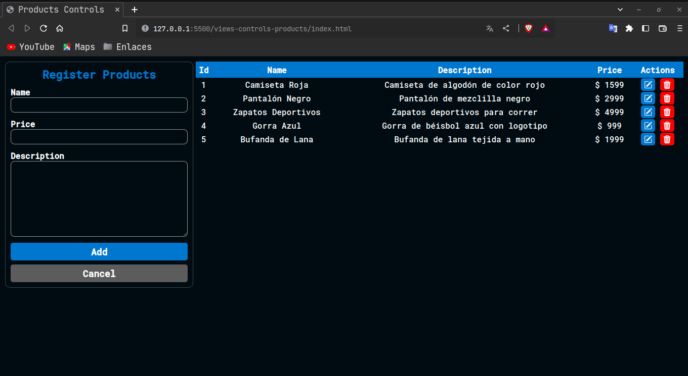

# Crud Básico con Express.js, TypeScript, MySQL, TypeORM y POO

El siguiente crud está realizado con una tabla en la base de datos de MySQL que estará gestionada por el ORM [TypeORM](https://typeorm.io/), se ha realizado bajo un control de productos.



## Table

|             | product      |     |                |
| ----------- | ------------ | --- | -------------- |
| id          | int          | Key | auto_increment |
| name        | varchar(100) |     |
| description | varchar(500) |     |
| price       | int          |     |

## Despues de haber clonado el proyecto diríjase al directorio de la api crud desde la terminal: cd api-crud-products, luego realice lo siguiente:

```bash
#Instalación
$ npm install
```

## Running

```bash
#Modo de desarrollo
$ npm run start
```

```bash
#Modo watch
$ npm run start:dev
```

```bash
#Modo build
$ npm run start:build
```
